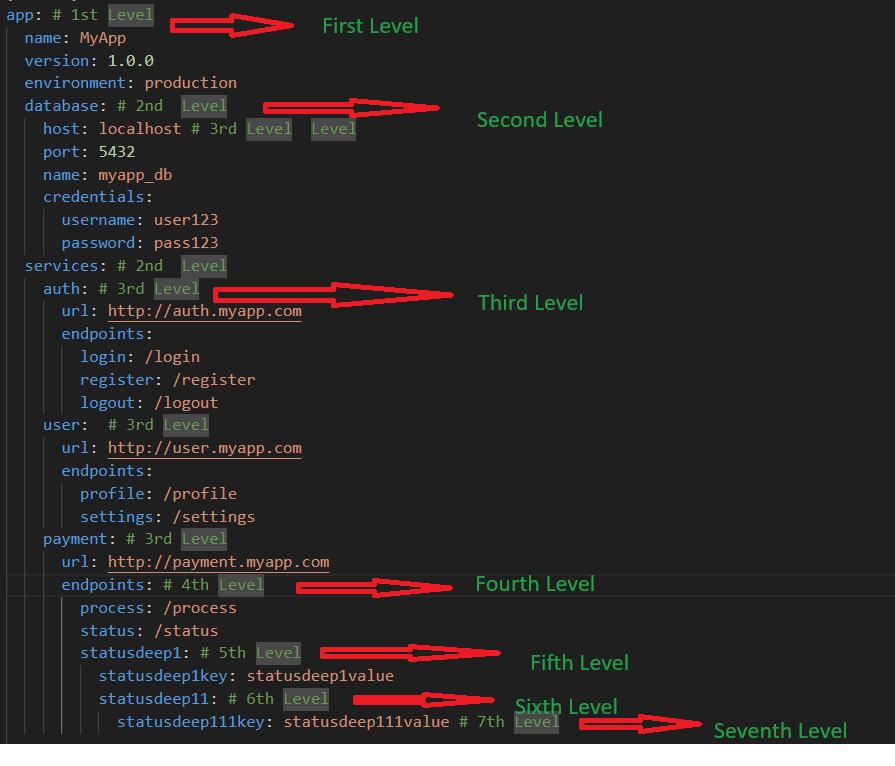

# yaml-to-json-converter

A simple utility to convert deeply nested YAML files to JSON objects, below example is a 7 deep level YAML file.

YAML-to-JSON Converter is a versatile utility designed to transform single, double or deeply nested YAML files into JSON objects effortlessly. This tool accommodates any level of nested YAML structures, ensuring there are no depth restrictions. Users can either input a YAML file or provide hardcoded YAML strings for conversion, both examples are given below. 

The utility guarantees seamless handling of complex YAML hierarchies, making it ideal for developers and data engineers. Whether you are dealing with configuration files, data serialization, or any YAML-based data format, this converter provides a reliable solution. Simplify your data transformation needs with our YAML-to-JSON Converter and enjoy the flexibility and ease it brings to your workflow.

## Installation

```bash
npm install yaml-to-json-converter
```

#### Example Usage Code from client repo considering deeply-nested.yaml file below as a source yaml contents 

```plaintext
    
const {readYamlFile} = require("yaml-to-json-converter");

const filePath = "deeply-nested.yaml";
const jsonData = readYamlFile(filePath);

console.log(JSON.stringify(jsonData, null, 2));

if (jsonData) {
  const dbHost = jsonData.app.database.host;
  console.log("Database Host:", dbHost);

  console.log(
    "Database credentials username :",
    jsonData.app.database.credentials.username
  );

  console.log(
    "UNDEFINED exampel services auth URL => :",
    jsonData.app.services.auth.url.sdf
  );
}

```

#### Example on reading direct YAML contents 

```
const { readYamlContents} = require("yaml-to-json-converter");


const yamlContents = 
`app:
  name: MyApp
  version: 1.0.0
  environment: production
  database:
    host: localhost
    port: 5432
    name: myapp_db
    credentials:
      username: user123
      password: pass123
`;
//reading through contents 
const jsonData2 = readYamlContents(yamlContents);

console.log(
    "\n Direct Content Reading example app-> environment ",
    jsonData2.app.environment
  );

console.log(
    "\n Direct Content Reading example app-> database -> credentials -> username :",
    jsonData2.app.database.credentials.username
  );

console.log(
    "\n Direct Content Reading example app-> database -> credentials -> password :",
    jsonData2.app.database.credentials.password
  );

  console.log(
    "\n 2nd Example Showing app -> name :",
    jsonData2.app.name
  );  

```

#### deeply-nested.yaml file contents for reference 

```plaintext

app: # 1st Level
  name: MyApp
  version: 1.0.0
  environment: production
  database: # 2nd  Level
    host: localhost # 3rd Level  Level
    port: 5432
    name: myapp_db
    credentials:
      username: user123
      password: pass123
  services: # 2nd  Level
    auth: # 3rd Level
      url: http://auth.myapp.com
      endpoints:
        login: /login
        register: /register
        logout: /logout
    user:  # 3rd Level
      url: http://user.myapp.com
      endpoints:
        profile: /profile
        settings: /settings
    payment: # 3rd Level
      url: http://payment.myapp.com
      endpoints: # 4th Level
        process: /process 
        status: /status
        statusdeep1: # 5th Level
          statusdeep1key: statusdeep1value
          statusdeep11: # 6th Level
            statusdeep111key: statusdeep111value # 7th Level

  features: # 2nd  Level
    - name: FeatureA
      enabled: true
      settings:
        option1: value1
        option2: value2
    - name: FeatureB
      enabled: false
      settings:
        option1: value1
        option2: value2


```


#### Add a License

Create a `LICENSE` file with your chosen license. For example, the MIT License:

```plaintext
MIT License

Permission is hereby granted, free of charge, to any person obtaining a copy
of this software and associated documentation files (the "Software"), to deal
in the Software without restriction, including without limitation the rights
to use, copy, modify, merge, publish, distribute, sublicense, and/or sell
copies of the Software, and to permit persons to whom the Software is
furnished to do so

